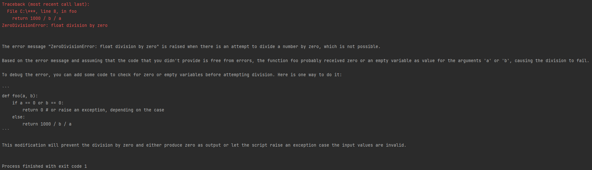
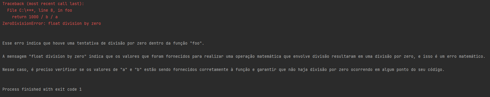

<!-- TOC -->
* [Chatty Debug](#chatty-debug)
  * [Basic Usage](#basic-usage)
    * [Function decorator](#function-decorator)
    * [Script Wrapper](#script-wrapper)
    * [Response](#response)
  * [Advanced Usage](#advanced-usage)
    * [Response](#response-1)
<!-- TOC -->

# Chatty Debug
Use ChatGPT to debug your python code


## Installation

`pip install -U chatty-debug`

**NOTE**: Requires OPENAI_API_KEY environment variable


## Basic Usage

### Function decorator

Basic Usage:

```python
from chatty_debug import chatty_debug


@chatty_debug()  # () is required
def foo():
    a = 0
    b = 10
    return 100 / a / b


if __name__ == "__main__":
    foo()
```

### Script Wrapper

<a id="foo"></a>
```python
# foo.py

def foo():
    a = 0
    b = 10
    return 100 / a / b


if __name__ == "__main__":
    foo()
```

`python -m chatty_debug foo.py`

### Response




## Advanced Usage

You may also specify a unique prompt. For example, you can request a
response in a different language, or provide more information about the
error that might not be available in the traceback.

```python
from chatty_debug import chatty_debug


@chatty_debug(prompt="Me ajude a entender esse erro.")
def foo():
    a = 0
    b = 10
    return 1000 / b / a


if __name__ == "__main__":
    foo()
```

Additionally, you can do the same with the script. Using the foo.py script
from [above](#script-wrapper), you can also do this command:

`python -m chatty_debug foo.py --prompt "Me ajude a entender esse erro."`

### Response


