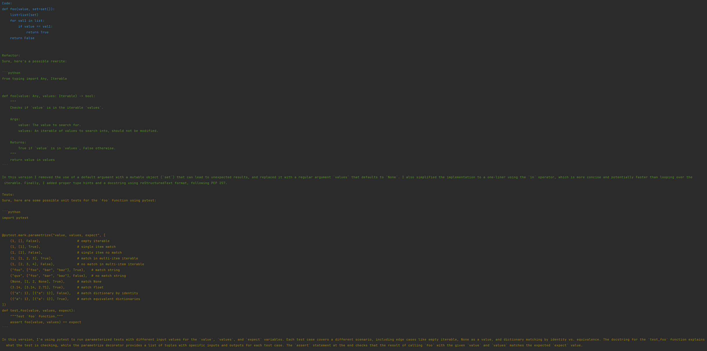

<!-- TOC -->
* [Chatty Debug](#chatty-debug)
  * [Installation](#installation)
  * [Basic Usage](#basic-usage)
    * [Function decorator](#function-decorator)
    * [Script Wrapper](#script-wrapper)
    * [Response](#response)
  * [Advanced Usage](#advanced-usage)
    * [Response](#response-1)
  * [Chatty Improvements](#chatty-improvements)
    * [Basic usage:](#basic-usage-)
    * [Response](#response-2)
<!-- TOC -->

# Chatty Debug
Use ChatGPT to debug your python code


## Installation

`pip install -U chatty-debug`

**NOTE**: Requires OPENAI_API_KEY environment variable


## Basic Usage

### Function decorator

```python
from chatty_debug import chatty_debug


@chatty_debug()  # () is required
def foo():
    a = 0
    b = 10
    return 100 / a / b


if __name__ == "__main__":
    foo()
```

### Script Wrapper

```python
# foo.py

def foo():
    a = 0
    b = 10
    return 100 / a / b


if __name__ == "__main__":
    foo()
```

`python -m chatty_debug foo.py`

### Response


## Advanced Usage

You may also specify a unique prompt. For example, you can request a
response in a different language, or provide more information about the
error that might not be available in the traceback.

```python
from chatty_debug import chatty_debug


@chatty_debug(prompt="Me ajude a entender esse erro.")
def foo():
    a = 0
    b = 10
    return 1000 / b / a


if __name__ == "__main__":
    foo()
```

Additionally, you can do the same with the script. Using the foo.py script
from [above](#script-wrapper), you can also do this command:

`python -m chatty_debug foo.py --prompt "Me ajude a entender esse erro."`

### Response


## Chatty Improvements

chatty-debug can also suggest improvements for your code.

### Basic usage:

Without further configuration, the decorator will submit a default prompt
presenting your function. ChatGPT will then be asked to suggest
improvements to it. It will then be asked to suggest some tests to improve
it. These default prompts can be edited, removed, and added to.

```python
from chatty_debug import suggest_improvements


@suggest_improvements()   # () is required
def foo(value, set=set()):
    list=list(set)
    for val1 in list:
        if value == val1:
            return True
    return False


if __name__ == '__main__':
    foo()
```

### Response


